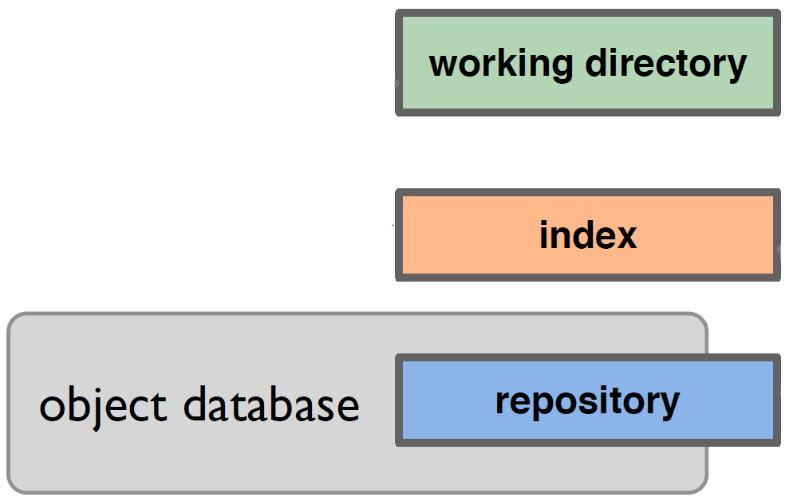
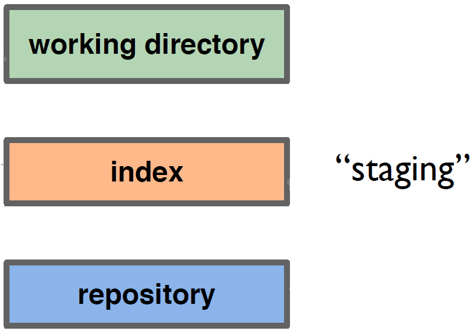

!SLIDE bullets incremental
# A Basic Workflow #

* Edit files
* Stage the changes
* Review your changes
* Commit the changes

!SLIDE center

!SLIDE center

!SLIDE center

!SLIDE center

!SLIDE center
# A Basic Workflow #

## Edit files ##
## Stage the changes ##
## Review your changes ##
## Commit the changes ##

!SLIDE code
	
	@@@ruby
	#! /usr/bin/env ruby
	
	# this program prints out 'hello world'

	puts 'hello world'