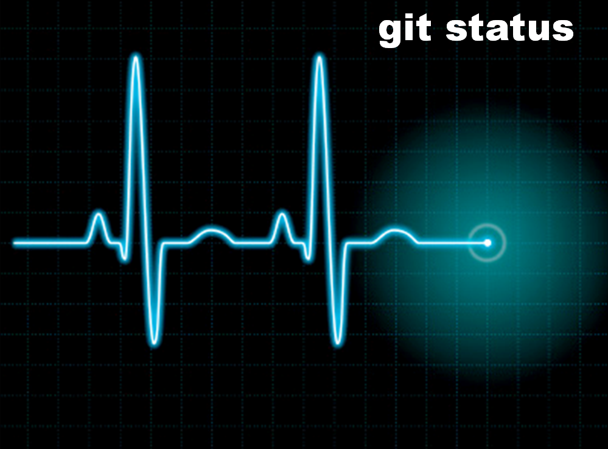

!SLIDE center

!SLIDE small

<pre>
$ git status
# On branch master
# Changed but not updated:
#   (use "git add <file>..." to update what will be committed)
#
#	modified:   main.rb
#
no changes added to commit (use "git add" and/or "git commit -a")
</pre>

!SLIDE small

<pre>
$ git status
# On branch master
# Changed but not STAGED:
#   (use "git add <file>..." to update what will be committed)
#
#	modified:   main.rb
#
no changes added to commit (use "git add" and/or "git commit -a")
</pre>
