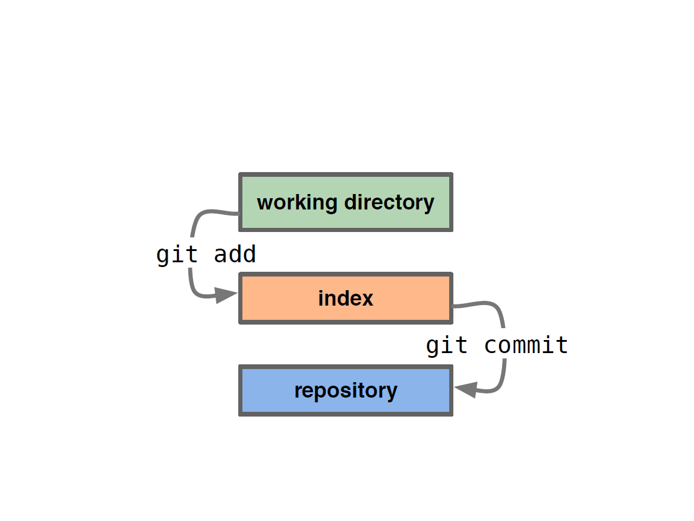

!SLIDE center
# A Basic Workflow #

## Edit files ##
## Stage the changes ##
## Review your changes ##
## Commit the changes ##

!SLIDE center

!SLIDE center

!SLIDE center

!SLIDE commandline incremental small

	$ git commit
	
	
	# Please enter the commit message for your changes. Lines starting
	# with '#' will be ignored, and an empty message aborts the commit.
	# On branch master
	# Changes to be committed:
	# (use "git reset HEAD <file>..." to unstage)
	#
	# modified: app.yaml
	# modified: main.rb
	#
	~
	~
	~
	~
	".git/COMMIT_EDITMSG" 10L, 279C
	
!SLIDE commandline small

	$ git commit
	
	descripitive commit message
	# Please enter the commit message for your changes. Lines starting
	# with '#' will be ignored, and an empty message aborts the commit.
	# On branch master
	# Changes to be committed:
	# (use "git reset HEAD <file>..." to unstage)
	#
	# modified: app.yaml
	# modified: main.rb
	#
	~
	~
	~
	~
	".git/COMMIT_EDITMSG" 10L, 279C
	
!SLIDE commandline small

	$ git commit
	
	Created commit 77d3001: descriptive commit message
	2 files changed, 4 insertions(+), 2 deletions(-)
	
!SLIDE center
# A Basic Workflow #

## Edit files	##
###vim / emacs / etc ###
## Stage the changes ##
###git add (file) ##
## Review your changes ##
### git status ###
## Commit the changes ##
### git commit ###

!SLIDE center
# cheating... #

!SLIDE center
# A Basicerer Workflow #

## Edit files	##
###vim / emacs / etc ###
## Stage & commit the changes ##
###git commit -a ##

!SLIDE center

!SLIDE center

!SLIDE center
