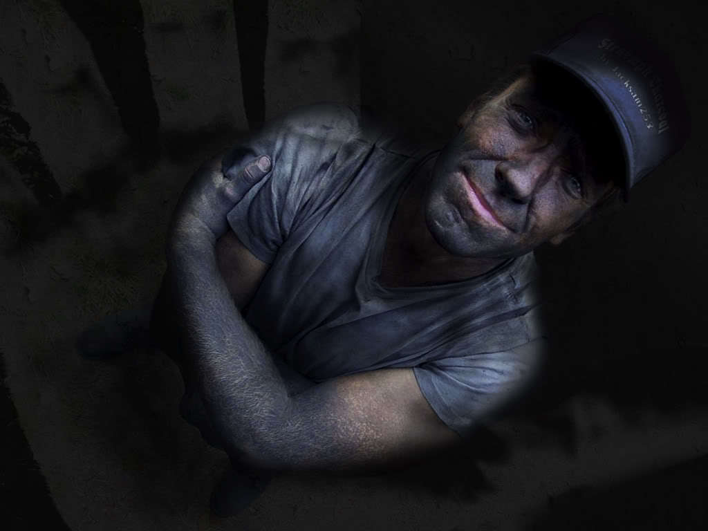

!SLIDE center

!SLIDE center
### Git reset, checkout & “bare double dash”, and revert ###

!SLIDE commandline incremental

	$ ### to unstage a file ###
	$ git reset HEAD <filename>

	$ ### another option ###
	$ git reset HEAD <filename>
	$ git config --global alias.unstage 'reset HEAD'
	$ git unstage README

	$ ### to clean out your working directory ###
	$ git reset --hard

!SLIDE commandline incremental

	$ ### to rollback uncommitted/staged files(s) ###
	$ git checkout -- <filename(s)>

!SLIDE commandline incremental

	$ ### undo a pushed commit ###
	$ git revert <SHA1>
	$ git revert HEAD
	$ git revert HEAD^
	$ git revert f7c7dd34

!SLIDE commandline incremental

	$ ### fixing the last commit message that has not been pushed ###
	$ git commit --amend

!SLIDE commandline incremental

	$ ### fixing commit message of commit more than 1 commit ago  ###
	$ git rebase -i HEAD~3
	$ ### choose edit for the one you want to change ###
