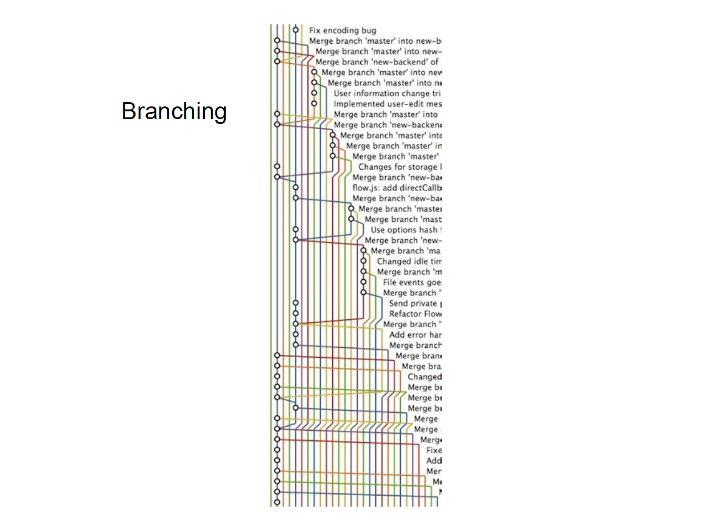
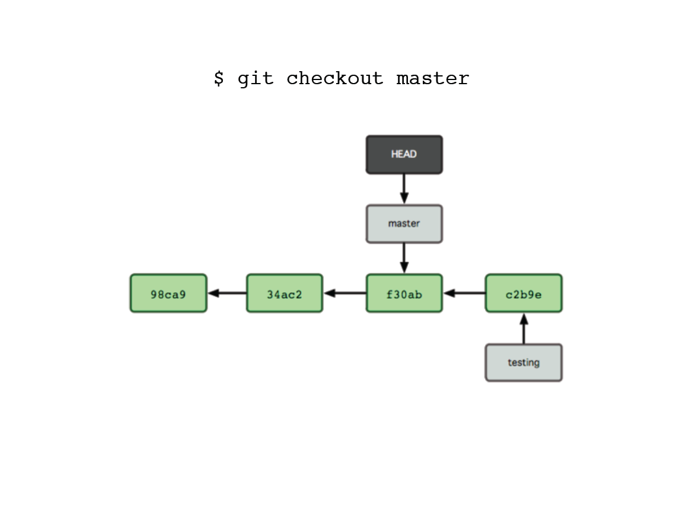
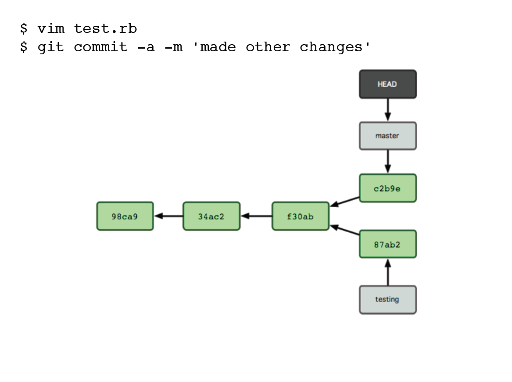

!SLIDE center

!SLIDE center
# What is a branch in Git? #

!SLIDE center
# Whoa.  Lets talk internals first, then branches #

!SLIDE center

!SLIDE center

!SLIDE center

!SLIDE center

!SLIDE commandline incremental

	$awesome>ls
	.
	|-- README
	`-- lib
		|-- inc
		| `-- tricks.rb
		`-- mylib.rb

!SLIDE commandline

	$awesome>ls
	.
	|-- README
	`-- lib (directory)
		|-- inc (directory)
		| `-- tricks.rb
		`-- mylib.rb
	2 directories
	
!SLIDE commandline

	$awesome>ls
	.
	|-- README (file)
	`-- lib
		|-- inc
		| `-- tricks.rb (file)
		`-- mylib.rb (file)
	3 files
	
!SLIDE center

!SLIDE center

!SLIDE center
# A branch is a lightweight movable pointer (to a commit) #

!SLIDE center

!SLIDE center

!SLIDE center

!SLIDE center

!SLIDE center

!SLIDE center

!SLIDE center

!SLIDE center

!SLIDE center

!SLIDE center

!SLIDE center

!SLIDE center

!SLIDE center
