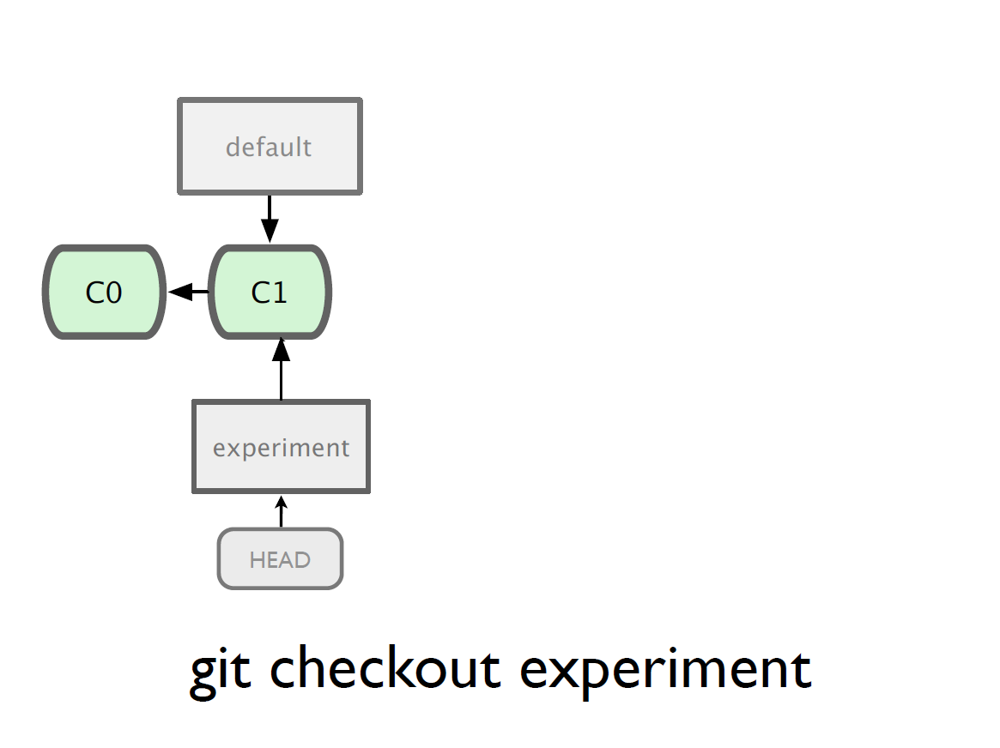
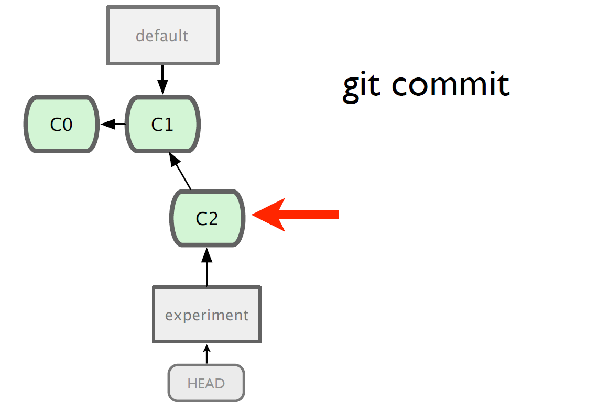
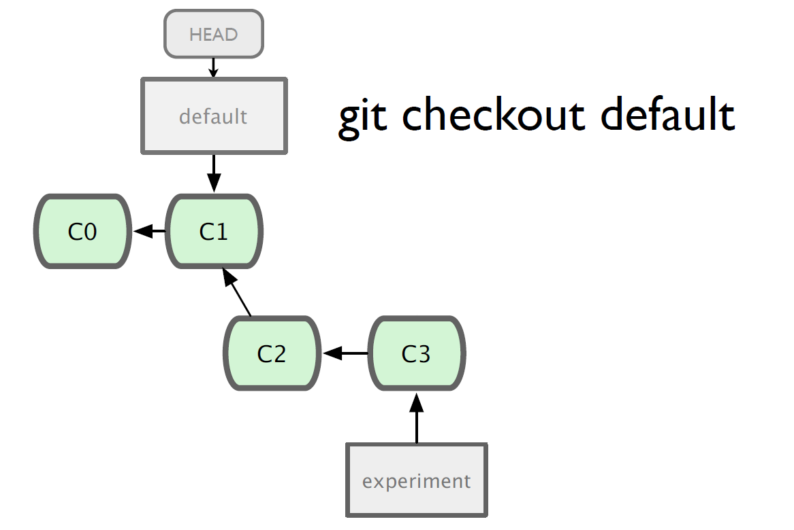
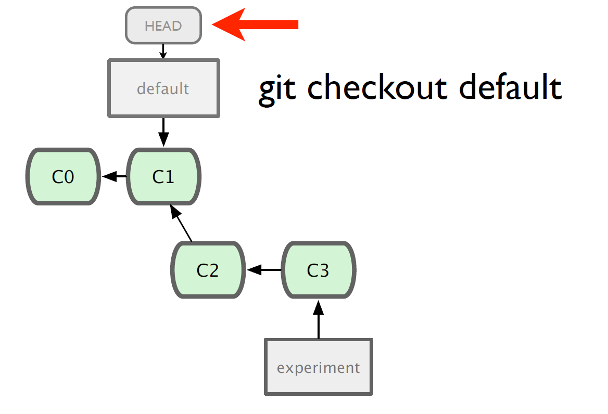
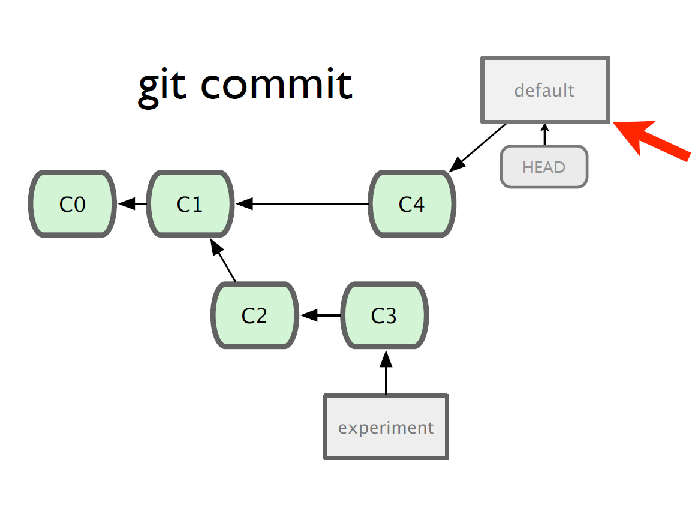
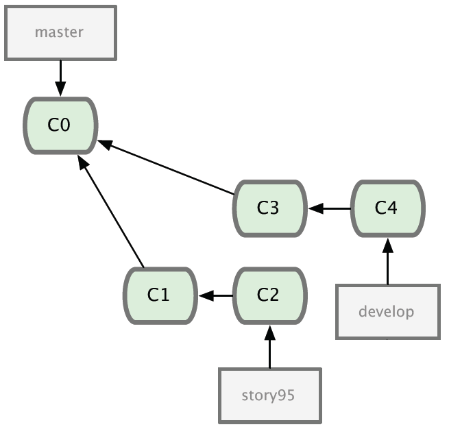

!SLIDE center

!SLIDE center

!SLIDE center

!SLIDE center

!SLIDE center

!SLIDE center

!SLIDE center

!SLIDE center

!SLIDE center

!SLIDE center

!SLIDE center

!SLIDE center

!SLIDE commandline incremental

	$ git branch
	* develop
	  master
	  story95
	$ git show-branch
	* [develop] new file_size function
	 ! [master] added cat-file
	  ! [story05] show-commit-tree added
	---
	  + [story95] show-commit-tree added
	  + [story95^] added revparse
	*   [develop] new file_size function
	*   [develop^] modified show to raw
	*++ [master] added cat-file
	
!SLIDE center
