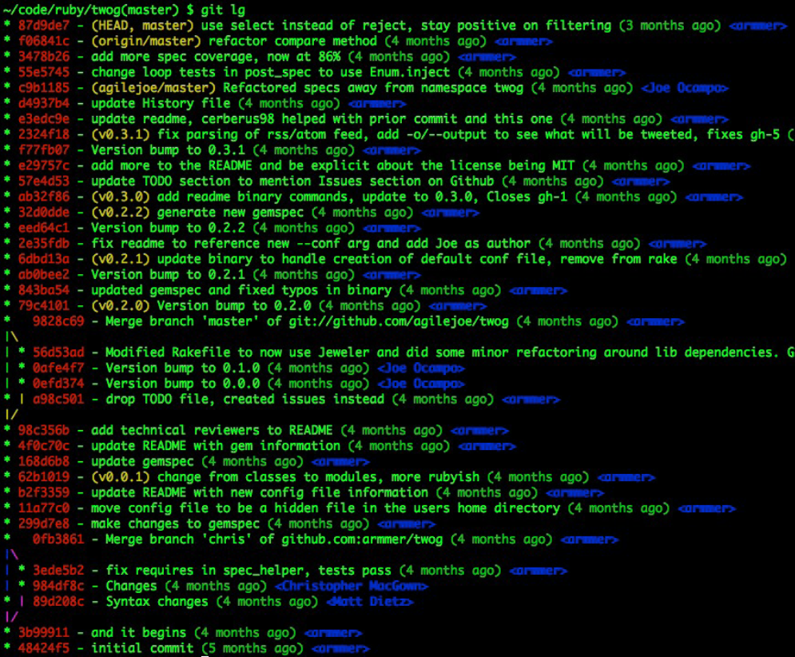

!SLIDE center

!SLIDE commandline incremental small
	$ git log
	commit da39a3ee5e6b4b0d3255bfef95601890afd80709
	Author: Jason Meridth <jmeridth@gmail.com>
	Date: Sun Apr 13 10:49:15 2008 -0700
		update README formatting and added blame
	
	commit 11f6ad8ec52a2984abaafd7c3b516503785c2072
	Author: Jason Meridth <jmeridth@gmail.com>
	Date: Sun Apr 13 10:45:15 2008 -0700
		changed my name a bit
	
	commit dd7b7b74ea160e049dd128478e074ce47254bde8
	Author: Jason Meridth <jmeridth@gmail.com>
	Date: Sun Apr 13 10:34:15 2008 -0700
		added ls-files
	
	commit b60d121b438a380c343d5ec3c2037564b82ffef3
	Author: Jason Meridth <jmeridth@gmail.com>
	Date: Sun Apr 13 12:13:15 2008 -0700
		made the ls-tree function recursive and list trees
		
!SLIDE commandline small
	$ git log
	commit da39a3ee5e6b4b0d3255bfef95601890afd80709 \
	Author: Jason Meridth <jmeridth@gmail.com>		 \  COMMIT
	Date: Sun Apr 13 10:49:15 2008 -0700			 /
		update README formatting and added blame	/
	
	commit 11f6ad8ec52a2984abaafd7c3b516503785c2072
	Author: Jason Meridth <jmeridth@gmail.com>
	Date: Sun Apr 13 10:45:15 2008 -0700
		changed my name a bit
	
	commit dd7b7b74ea160e049dd128478e074ce47254bde8
	Author: Jason Meridth <jmeridth@gmail.com>
	Date: Sun Apr 13 10:34:15 2008 -0700
		added ls-files
	
	commit b60d121b438a380c343d5ec3c2037564b82ffef3
	Author: Jason Meridth <jmeridth@gmail.com>
	Date: Sun Apr 13 12:13:15 2008 -0700
		made the ls-tree function recursive and list trees

!SLIDE commandline small
	$ git log
	commit da39a3ee5e6b4b0d3255bfef95601890afd80709
	Author: Jason Meridth <jmeridth@gmail.com>
	Date: Sun Apr 13 10:49:15 2008 -0700
		update README formatting and added blame
	
	commit 11f6ad8ec52a2984abaafd7c3b516503785c2072 \
	Author: Jason Meridth <jmeridth@gmail.com>		 \  COMMIT
	Date: Sun Apr 13 10:45:15 2008 -0700			 /
		changed my name a bit						/
	
	commit dd7b7b74ea160e049dd128478e074ce47254bde8
	Author: Jason Meridth <jmeridth@gmail.com>
	Date: Sun Apr 13 10:34:15 2008 -0700
		added ls-files
	
	commit b60d121b438a380c343d5ec3c2037564b82ffef3
	Author: Jason Meridth <jmeridth@gmail.com>
	Date: Sun Apr 13 12:13:15 2008 -0700
		made the ls-tree function recursive and list trees
	
!SLIDE commandline small
	$ git log
	commit da39a3ee5e6b4b0d3255bfef95601890afd80709 
	Author: Jason Meridth <jmeridth@gmail.com>
	Date: Sun Apr 13 10:49:15 2008 -0700			
		update README formatting and added blame
	
	commit 11f6ad8ec52a2984abaafd7c3b516503785c2072
	Author: Jason Meridth <jmeridth@gmail.com>
	Date: Sun Apr 13 10:45:15 2008 -0700
		changed my name a bit
	
	commit dd7b7b74ea160e049dd128478e074ce47254bde8		<== SHA1 (unique)
	Author: Jason Meridth <jmeridth@gmail.com>
	Date: Sun Apr 13 10:34:15 2008 -0700
		added ls-files
	
	commit b60d121b438a380c343d5ec3c2037564b82ffef3
	Author: Jason Meridth <jmeridth@gmail.com>
	Date: Sun Apr 13 12:13:15 2008 -0700
		made the ls-tree function recursive and list trees

!SLIDE commandline small
	$ git log
	commit da39a3ee5e6b4b0d3255bfef95601890afd80709
	Author: Jason Meridth <jmeridth@gmail.com>
	Date: Sun Apr 13 10:49:15 2008 -0700
		update README formatting and added blame
	
	commit 11f6ad8ec52a2984abaafd7c3b516503785c2072
	Author: Jason Meridth <jmeridth@gmail.com>
	Date: Sun Apr 13 10:45:15 2008 -0700
		changed my name a bit
	
	commit dd7b7b74ea160e049dd128478e074ce47254bde8
	Author: Jason Meridth <jmeridth@gmail.com>		<== Author & Email
	Date: Sun Apr 13 10:34:15 2008 -0700			   (we set earlier)
		added ls-files
	
	commit b60d121b438a380c343d5ec3c2037564b82ffef3
	Author: Jason Meridth <jmeridth@gmail.com>
	Date: Sun Apr 13 12:13:15 2008 -0700
		made the ls-tree function recursive and list trees

!SLIDE commandline small
	$ git log
	commit da39a3ee5e6b4b0d3255bfef95601890afd80709
	Author: Jason Meridth <jmeridth@gmail.com>
	Date: Sun Apr 13 10:49:15 2008 -0700
		update README formatting and added blame
	
	commit 11f6ad8ec52a2984abaafd7c3b516503785c2072
	Author: Jason Meridth <jmeridth@gmail.com>
	Date: Sun Apr 13 10:45:15 2008 -0700
		changed my name a bit
	
	commit dd7b7b74ea160e049dd128478e074ce47254bde8
	Author: Jason Meridth <jmeridth@gmail.com>
	Date: Sun Apr 13 10:34:15 2008 -0700			<== Date/Time stamp
		added ls-files
	
	commit b60d121b438a380c343d5ec3c2037564b82ffef3
	Author: Jason Meridth <jmeridth@gmail.com>
	Date: Sun Apr 13 12:13:15 2008 -0700
		made the ls-tree function recursive and list trees
		
!SLIDE commandline small
	$ git log
	commit da39a3ee5e6b4b0d3255bfef95601890afd80709
	Author: Jason Meridth <jmeridth@gmail.com>
	Date: Sun Apr 13 10:49:15 2008 -0700
		update README formatting and added blame
	
	commit 11f6ad8ec52a2984abaafd7c3b516503785c2072
	Author: Jason Meridth <jmeridth@gmail.com>
	Date: Sun Apr 13 10:45:15 2008 -0700
		changed my name a bit
	
	commit dd7b7b74ea160e049dd128478e074ce47254bde8
	Author: Jason Meridth <jmeridth@gmail.com>
	Date: Sun Apr 13 10:34:15 2008 -0700
		added ls-files					    			<== commit message
	
	commit b60d121b438a380c343d5ec3c2037564b82ffef3
	Author: Jason Meridth <jmeridth@gmail.com>
	Date: Sun Apr 13 12:13:15 2008 -0700
		made the ls-tree function recursive and list trees
		
!SLIDE
# git log --pretty #

!SLIDE commandline incremental small

	$git log --pretty=oneline
	da39a3ee5e6b4b0d3255bfef95601890afd80709 update README formatting and added blame
	11f6ad8ec52a2984abaafd7c3b516503785c2072 changed my name a bit
	dd7b7b74ea160e049dd128478e074ce47254bde8 added ls-files
	b60d121b438a380c343d5ec3c2037564b82ffef3 made the ls-tree function recursive and list trees
	4ad583af22c2e7d40c1c916b2920299155a46464 limiting log to 30
	9addbf544119efa4a64223b649750a510f0d463f -added todo options
	018f4d7f06cb8626e1756452581373e05ae41c56 added limit to log function
	2db6d21d365f544f7ca3bcfb443ac96898a7a069 fixed conflict
	bcf22dfc6fb76b7366b1f1675baf2332a0e6a7ce new version 0.1.2
	70374248fd7129088fef42b8f568443f6dce3a48 new version 0.1.0
	
!SLIDE commandline incremental small

	$git log --pretty=format:"%h %an %ar - %s"
	da39a3e Jason Meridth 47 minutes ago - update README formatting and added blame
	11f6ad8 Jason Meridth 56 minutes ago - changed my name a bit
	dd7b7b7 Jason Meridth 60 minutes ago - added ls-files
	b60d121 Jason Meridth 2 weeks ago - made the ls-tree function recursive and list trees
	4ad583a Jason Meridth 2 weeks ago - limiting log to 30
	9addbf5 Jason Meridth 2 weeks ago - -added todo options
	018f4d7 Jason Meridth 2 weeks ago - added limit to log function
	2db6d21 Jason Meridth 3 weeks ago - fixed conflict
	bcf22df Jason Meridth 3 weeks ago - new version 0.1.2
	7037424 Jason Meridth 3 weeks ago - new version 0.1.0
	
!SLIDE
##[Pimping out Git log](http://www.jukie.net/bart/blog/pimping-out-git-log "Pimping out Git log")##
  
**git config --global alias.lg "log --graph --pretty=format:'%Cred%h%Creset -%C(yellow)
%d%Creset %s %Cgreen(%cr) %C(bold blue)<%an>%Creset' --abbrev-commit --date=relative"**

!SLIDE center

