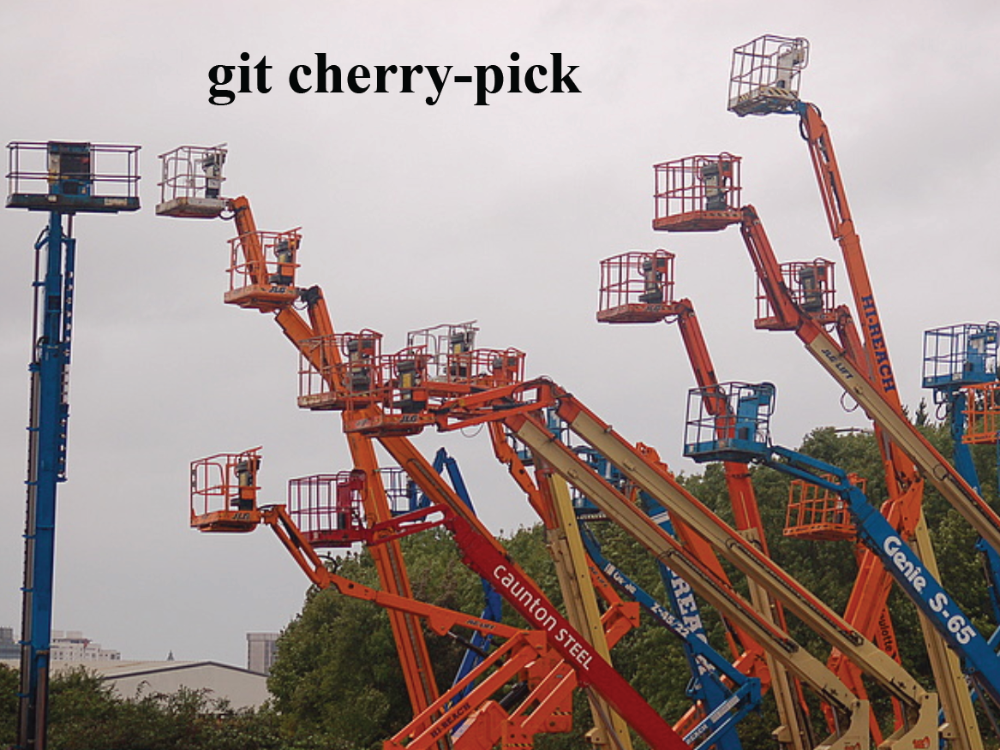

!SLIDE center

!SLIDE center
[http://www.gitready.com/intermediate/2009/03/04/pick-out-individual-commits.html](http://www.gitready.com/intermediate/2009/03/04/pick-out-individual-commits.html)
  

!SLIDE small

<pre>
$ git cherry-pick b50788b
Finished one cherry-pick.
[master]: created bcb0d1b: "First pass at rake
task."
	3 files changed, 63 insertions(+), 3 deletions(-)
	create mode 100644 lib/jekyll/task.rb

$ git log --pretty=oneline --abbrev-commit
HEAD~3..HEAD
bcb0d1b... First pass at rake task.
2569e9f... update history
2135a53... Using block syntax of popen4 to ensure
that subprocesses...
</pre>

!SLIDE small

<pre>
$ git cherry-pick b50788b
Finished one cherry-pick.
[master]: created bcb0d1b: "First pass at rake
task."
	3 files changed, 63 insertions(+), 3 deletions(-)
	create mode 100644 lib/jekyll/task.rb

$ git log --pretty=oneline --abbrev-commit
HEAD~3..HEAD
bcb0d1b... First pass at rake task.
2569e9f... update history
2135a53... Using block syntax of popen4 to ensure
that subprocesses...
</pre>

!SLIDE center
[http://www.gitready.com/intermediate/2009/03/04/pick-out-individual-commits.html](http://www.gitready.com/intermediate/2009/03/04/pick-out-individual-commits.html)
  
