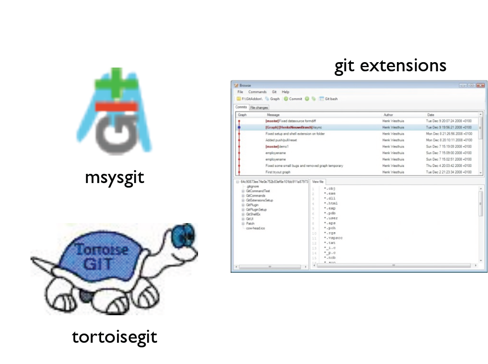
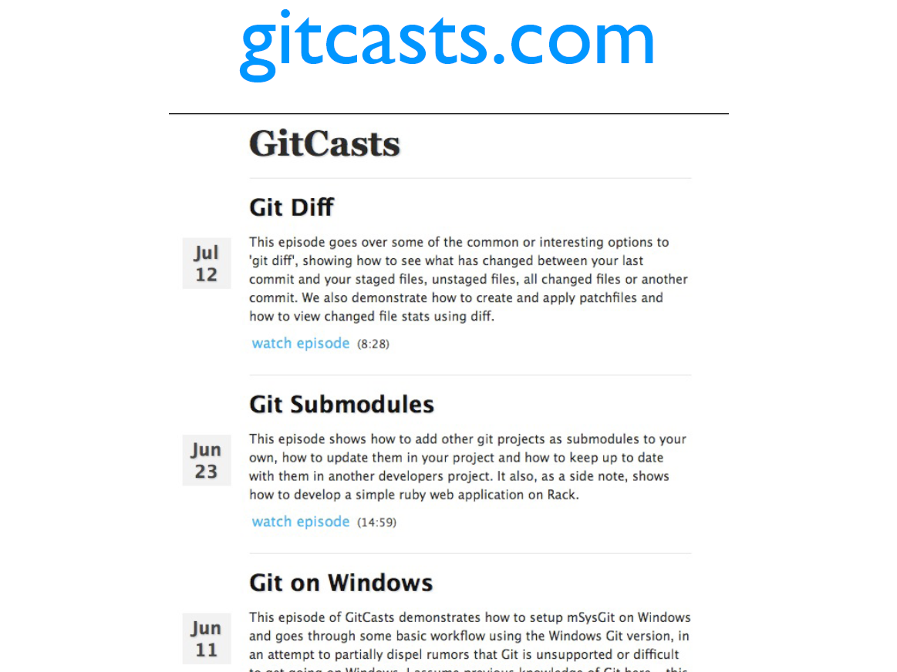
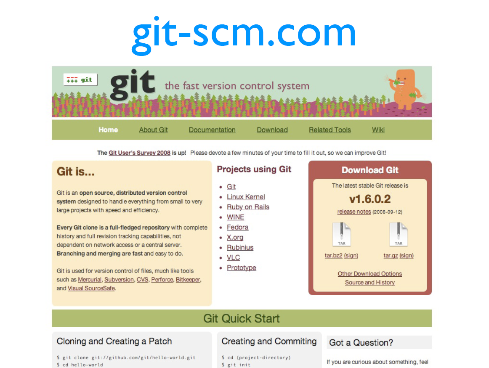

!SLIDE center
# Resources #

!SLIDE center

!SLIDE center
# #git / #github on IRC

!SLIDE center

!SLIDE center

!SLIDE center

!SLIDE center

!SLIDE center

!SLIDE center

!SLIDE center

!SLIDE center

!SLIDE center

!SLIDE center

!SLIDE center

!SLIDE center

!SLIDE small
# Credits #
 
#### IMAGES ####
#### http://andyjeffries.co.uk/uploads/articles/33/view_git-logo.png ####
#### http://blog.nodeta.fi/wp-content/uploads/2009/07/git-branching.jpg ####
#### http://lh5.ggpht.com/_0bryoDBVh14/SaiMJc039YI/AAAAAAAAAMo/cgBE51F9jos/s400/three_amigos_ver2-770439.jpg ####
#### http://progit.org/ (images) ####
#### http://book.git-scm.com (images) ####
#### http://commune.s3.amazonaws.com/uploaded/cusp/site/github.png ####
#### http://antonlindstrom.com/public/graphic/octocat_stroked.png ####
#### http://progit.org/figures/ch4/18333fig0401-tn.png ####
#### http://upload.wikimedia.org/wikipedia/en/9/93/Gitorious.png ####
#### http://www.stoppress.co.nz/wp-content/uploads/2010/01/Merge-main_Full.jpg ####
#### http://rubyrags.com/pictures/0000/0097/rebase.png?1219366613 ####
#### http://www.aim-hq.org/Toolbox.jpg ####
#### http://theacademy.sdsu.edu/programs/BHETA/laptop-guy.jpg ####
#### http://farm4.static.flickr.com/3120/3174148419_51d09db6e5.jpg ####
#### http://www.flickr.com/photos/waltjabsco/2767960923/sizes/o/ ####
#### http://www.gitready.com/images/pick.png ####
 
#### BOOKS ####
#### Pro Git by Scott Chacon - http://progit.org/book/ ####
#### Git Community Book by Scott Chacon - http://book.git-scm.com ####
#### Pragmatic Version Control Using Git by Travis Swicegood - http://www.pragprog.com/titles/tsgit/pragmatic-version-control-using-git ####
 
#### WEBSITES ####
#### http://progit.org/blog ####
#### http://gitready.com ####
#### http://help.github.com ####
#### http://learn.github.com ####
 
Slide decks used with permission of Scott Chacon
[http://github.com/schacon/git-presentations](http://github.com/schacon/git-presentations)

!SLIDE center
